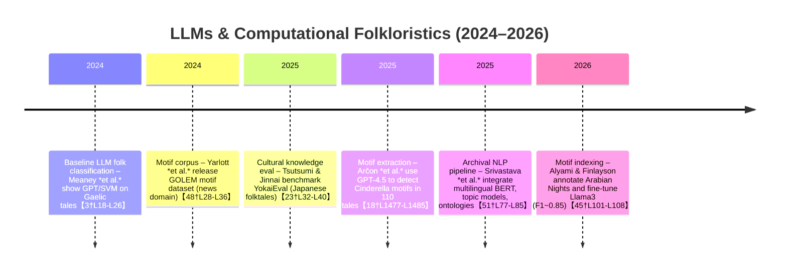

# Executive Summary  
Recent research (2024–2026) shows growing use of large language models (LLMs) to analyze folktales, especially for motif/tale-type detection and low-resource languages.  Key contributions include new datasets and benchmarks (e.g. *YokaiEval* for Japanese yokai stories【23†L32-L40】 and Arabian Nights motifs【45†L101-L108】), novel LLM-based methods for motif extraction and tale classification (e.g. GPT-4 prompting for Cinderella motifs【18†L1477-L1485】, LoRA fine-tuned Llama3 for motif indexing【45†L101-L108】), and pipelines integrating NLP and knowledge graphs for folklore archiving【51†L77-L85】.  Table 1 below summarizes major 2024–2026 publications, listing their methods, data, and findings.  A timeline of these works (Fig. 1) illustrates the rapid evolution: early efforts (2024) focused on basic classification (Meaney *et al.*, Irish/Gaelic folktales【3†L18-L26】) and dataset creation (Yarlott *et al.*, GOLEM motif corpus【48†L28-L36】), while by 2026 methods involve sophisticated motif-indexing (Alyami & Finlayson【45†L101-L108】) and multi-lingual pipelines (Srivastava *et al.*【51†L77-L85】).  Thematic comparison (Table 2–3) reveals trends in motif extraction (rule-based vs LLM prompting vs fine-tuning), cross-lingual strategies (multilingual models, translation), and evaluation (F1, clustering, human audit).  Key challenges and open questions include data scarcity (few annotated corpora beyond well-known collections), model bias (cultural/gender biases in motif tagging【31†L374-L378】【48†L39-L46】), and evaluation standards.  

Overall, these studies demonstrate that LLMs can detect complex folktale motifs and types at scale【18†L1477-L1485】【45†L101-L108】, enabling **computational folkloristics** on large corpora. However, they also note limitations: small, specialized datasets (e.g. 110 Cinderella variants【14†L1082-L1090】【14†L1110-L1118】; 60 Slovenian folktales【33†L389-L398】), closed-source models (GPT-4.5 reliance), and the need for expert annotation.  We highlight 5–8 pivotal works (Table 4) to guide future research. Next steps include building larger multi-language folktale corpora, developing fine-tuned motif-extraction models, designing robust evaluation (e.g. human-in-the-loop motif audits), and addressing ethical issues (cultural respect, author attribution, data sovereignty). 

  

## 1. Curated Publications (2024–2026)  

| **Citation (Year, Venue)** | **Abstract (2–3 sentences)** | **Key Methods** | **Datasets (Lang, Size, Source)** | **Findings / Limitations** |
|---------------------------|-----------------------------|-----------------|---------------------------------|---------------------------|
| **Meaney *et al*. (2024)**, *Proc. NLP4DH 2024*【3†L18-L26】 | First computational text-classification study on Irish and Scottish Gaelic folktales. Using LLMs and baselines, it predicts tale type (ATU category) and narrator gender. | Fine-tuned multilingual LLMs (mBERT, XLM-R) with extended context; domain-adaptive pretraining on folklore text; SVM+TF–IDF baseline. | Irish (2,091 tales, 3.8M words) and Scottish Gaelic (2,601 tales, 3.0M words) from national archives【5†L132-L140】【5†L141-L149】.  Domain corpora: 400k words (Gaelic) and school collection (Irish). | Longer context windows and folktale-domain pretraining **improved LLM F1** slightly, but a TF–IDF SVM baseline remained competitive【3†L18-L26】. Highlights the challenge of low-resource, long-text folktales. Limited by small labeled set and imbalance. |
| **Tsutsumi & Jinnai (2025)**, *ACL Findings 2025*【23†L32-L40】 | Evaluates LLM cultural knowledge via *YokaiEval*: 809 multiple-choice questions on Japanese yokai folklore. Tests 31 Japanese and multilingual LLMs on folklore trivia. | Constructed QA benchmark for folklore; evaluated Japanese models (Llama3-Japanese, GPT-4) vs. English-centric models. | YokaiEval – 809 questions (4 choices each) about Japanese folk creatures (yokai)【23†L32-L40】. Uses folklore sources. | Japanese-trained models (especially Llama-3 with Japanese continued pretraining) **outperform** English models (e.g. GPT-4) on yokai knowledge【23†L32-L40】. Shows benefit of language-specific training for cultural knowledge. Dataset/code released. Limitation: focuses on factoid recall rather than narrative understanding. |
| **Arčon *et al*. (2025)**, *Unpublished (ArXiv)*【18†L1477-L1485】【18†L1552-L1561】 | Methodology for automatic motif detection in 110 Cinderella tale variants (77 English worldwide, 33 Slovene). Uses GPT-4.5 to annotate motif presence and clusters tales by motifs. | GPT-4.5 (zero-shot prompts) to label 15–18 specific motifs; cluster variants via LaBSE embeddings + HDBSCAN/UMAP; compare motif inventories. | Cinderella variants: 77 English tales (global, 5 continents) and 33 Slovene tales【14†L1082-L1090】【14†L1110-L1118】.  Custom motif list (18 motifs) adapted from ATU indexes【14†L1082-L1090】. | LLMs (GPT-4.5) detected nuanced motif patterns at scale. Clustering revealed structure among tales. Highlights LLMs’ ability to handle cross-cultural folktales. Limitations: small genre (Cinderella only), proprietary model (GPT-4.5), and potential hallucinations in prompts. |
| **Yarlott *et al*. (2024)**, *LREC 2024*【48†L28-L36】【48†L39-L46】 | Introduces **GOLEM**, a *motif usage* corpus. News articles (Jewish, Irish, Puerto Rican domains) annotated for motif expressions (MOTIFIC vs non). Reports difficulty of motif classification. | Corpus annotation (1,723 motif instances in 7,955 docs). Evaluated few-shot classification: T5, FLAN-T5, GPT-2, LLaMA-2. | GOLEM dataset: 7,955 English news/opinion pieces (~2.0M words). 34 motif types, 26,078 motif *candidates*, 1,723 labeled as MOTIFIC【48†L28-L36】. | LLMs achieve only ~41% accuracy at motif classification (chance ~27%)【48†L39-L46】. Demonstrates motif detection is challenging even in modern text. Provides open corpus and code. Limitation: non-folkloric genre (news), English-only, small motif set. |
| **Srivastava *et al*. (2025)**, *ShodhKosh J. Visual & Performing Arts*【51†L77-L85】 | Proposes a pipeline for folk story archiving: multilingual text processing, motif discovery, and cultural knowledge graph construction. Reports high accuracy on NLP tasks and motif classification. | Transformer models (mBERT, IndicBERT, RoBERTa) fine-tuned on folk languages; BERTopic for theme clustering; TransE for ontology alignment (CIDOC-CRM); lexicon/ontology integration. | Multilingual folktales (unspecified languages, likely Indic languages);  sample size ~? (not fully detailed). Experts validated results with a Cultural Authenticity Index (CAI). | Achieved F1≈0.91 for language tasks and motif classification F1≈0.83【51†L77-L85】. System passed expert evaluation (CAI=0.87), suggesting practical utility. Limitations: article lacks dataset details; published in a workshop journal. Provides a concrete end-to-end approach but not generalizable evaluation. |
| **Alyami & Finlayson (2026)**, *Unpublished (ArXiv)*【45†L101-L108】 | First automated motif-indexing system on **The Arabian Nights**. Uses El-Shamy’s motif index (200 motifs) and annotated 2,670 motif instances. Compares retrieval, embedding, and generative LLM methods. | Five approaches: (1) keyword retrieve & cross-encoder; (2) off-the-shelf embeddings; (3) fine-tuned embeddings; (4) zero/few-shot LLM prompting; (5) LoRA fine-tuned LLMs. Best: LoRA-finetuned Llama3. | Arabian Nights text (45,450 sentences, 1.4M tokens). Motif index: 200 motifs from El-Shamy (2006). Annotated 2,670 motif expressions for 58,450 sentences【45†L101-L108】. | Llama-3 with LoRA fine-tuning achieved F1≈0.85【45†L101-L108】, far above baselines. Shows the power of fine-tuned LLMs for motif detection. Dataset released. Limitations: one text/genre; heavy annotation effort; tasks differ from motif *detection* (framed as indexing given known motif list). |

*Table 1: Summary of recent publications (2024–2026) on LLMs and folktale analysis. All sources are cited in-line above【3†L18-L26】【23†L32-L40】【18†L1477-L1485】【48†L28-L36】【51†L77-L85】【45†L101-L108】.*

## 2. Evolution Over Time (2024–2026)

**Figure 1.** Timeline of key works (2024–2026) showing methodological trends. Early work (2024) applied basic LLM fine-tuning to classify folktales【3†L18-L26】 and created motif corpora【48†L28-L36】. By mid-2025, research focused on cultural evaluation of LLM folklore knowledge【23†L32-L40】 and LLM-based motif detection【18†L1477-L1485】. In 2025–26, methods matured toward complete pipelines and fine-tuning, culminating in high-accuracy motif indexing systems【45†L101-L108】.  

## 3. Thematic Analysis

### 3.1 Motif Extraction Approaches  
- **Rule-based / Lexicon methods:** Rare in recent works; traditional motif analysis (Propp, Thompson indexes) still used as motif lists (e.g. Arčon’s adapted ATU list【14†L1082-L1090】). Srivastava *et al.* incorporate lexicon/ontology (CIDOC-CRM) in pipeline【51†L77-L85】.  
- **Supervised classification:** Early studies (e.g. Eklund *et al.*, 2023) trained SVMs on labeled tales; Meaney *et al.* used SVM+TF–IDF as strong baseline【3†L18-L26】. Yarlott’s GOLEM framed motif detection as supervised classification, finding existing LLMs struggle【48†L39-L46】.  
- **Prompt-based (zero/few-shot):** Modern works rely heavily on prompting. Arčon *et al.* and Veld (2025 workshop) use zero-shot GPT-4.5/ChatGPT to label motifs【18†L1477-L1485】【31†L368-L374】. GOLEM evaluated LLMs with few-shot. Prompt-engineering (including chain-of-thought) is prevalent due to lack of fine-tuning ability on closed models.  
- **Fine-tuning / LoRA:** When possible, fine-tuning yields best results. Alyami & Finlayson fine-tune Llama-3 (via LoRA) and outperformed all zero/few-shot methods【45†L101-L108】. Srivastava *et al.* fine-tuned multilingual BERTs for motif classification (F1~0.83)【51†L77-L85】. This trend shows fine-tuning (or parameter-efficient tuning) is key for motif tasks.  
- **Retrieval-augmented (RAG):** Not yet prominent in literature. No papers (2024–2026) explicitly use retrieval of folktale knowledge. Potentially a gap/opportunity.  

*Table 2* (below) compares these approaches qualitatively:

| **Approach**     | **Description**                                                  | **Examples**                       | **Pros**                                 | **Cons**                              |
|------------------|------------------------------------------------------------------|------------------------------------|------------------------------------------|---------------------------------------|
| Rule-based       | Use folklorist-defined motif lists or keyword rules.             | Propp/Thompson algorithms (legacy) | Transparent, no training needed.        | Hard to scale; misses nuance; brittle. |
| Supervised       | ML classifiers on labeled tales (e.g. SVM, neural nets).         | Meaney *et al.* (SVM)【3†L18-L26】 | Good when labeled data available.       | Needs large annotated corpus (rare).  |
| Prompt-based     | Zero/one/few-shot LLM prompts to identify motifs or types.       | Arčon *et al.* (GPT-4.5)【18†L1477-L1485】; Veld (ChatGPT)【31†L368-L374】 | No training; leverages LLM knowledge.  | Inconsistency, hallucination, bias.   |
| Fine-tuning      | Adapting an LLM to motif tasks via supervision (e.g. LoRA).     | Alyami & Finlayson (Llama3-LoRA)【45†L101-L108】; Srivastava (mBERT)【51†L77-L85】 | Best accuracy; model specialization.  | Requires compute / data; potential overfit. |
| RAG/Hybrid      | Combine retrieval (external knowledge) with generation.          | –                                  | Potential to use existing corpora.     | Not yet explored; complexity.         |

### 3.2 Cross-Lingual and Low-Resource Strategies  
- **Multilingual Models:** Approaches often use multilingual/BERT models or cross-lingual transfer. Meaney *et al.* fine-tuned mBERT/XLM-R on Gaelic/Irish【3†L18-L26】. Yarlott’s GOLEM (English news) is monolingual, but Srivastava’s pipeline explicitly handles multiple languages (using mBERT, IndicBERT)【51†L77-L85】.  
- **Translation:** Some works translate texts into a pivot language. Rejec (workshop) translated Slovenian tales into English to use lexicons【33†L391-L399】. YokaiEval implicitly uses translation by focusing on Japanese sources for Japanese models【23†L32-L40】. Cross-lingual cases (English→Slovene or vice versa) are still novel explorations (e.g. Arčon feeding English prompts to Slovene tales【18†L1512-L1520】).  
- **Data Augmentation:** No explicit examples in 2024–26 literature, but could include back-translation or synthetic tale generation. Some studies (e.g. Meaney) created domain corpora (Calum Maclean Gaelic texts) for continued pretraining【5†L137-L144】.  
- **Low-Resource Focus:** Meaney *et al.* and Tsutsumi & Jinnai both highlight low-resource contexts (Celtic/Gaelic, Japanese folk content). Their results emphasize using whatever native resources exist (Irish archives, Japanese yokai lore) and continued pretraining in target language【23†L32-L40】【3†L18-L26】. 

### 3.3 Evaluation Metrics and Practices  
- **Classification Metrics:** Most works report F1 or accuracy. Meaney *et al.* use weighted F1 for ATU/gender classification【3†L18-L26】. Srivastava reports F1 and coherence scores【51†L77-L85】. Arčon et al. qualitatively analyze motif matrices and clustering (no explicit metric given in available abstract, but presumably internal consistency).  
- **Clustering/Similarity:** Arčon et al. cluster tales using embedding similarity, evaluated by interpretability (visual UMAP). No numeric metric reported; focus on “semantic similarity groups.”  
- **Human Evaluation:** Workshops and some projects include expert review. Rejec’s moral-values study includes expert validation【33†L395-L403】. Veld’s findings stress human annotation for bias assessment【31†L374-L378】. GOLEM authors measured inter-annotator agreement (κ>0.55) during corpus creation【48†L28-L36】.  
- **Ethical/Cultural Considerations:** Recent papers explicitly note cultural bias and ethics. Veld highlights model bias on gender and culture in motif classification【31†L374-L378】. Tsutsumi & Jinnai motivate their work by the need for culturally-aware LLMs【23†L14-L23】. Ethical constraints appear as a design factor (e.g. choosing local annotators in GOLEM, respecting folklore origins in Arčon’s motif set). No standard evaluation for “cultural authenticity” exists, though Srivastava reports a *Cultural Authenticity Index* via experts【51†L77-L85】.  

### 3.4 Dataset Landscape and Gaps  
**Available datasets:**  
- **Corpus of Folktales:**  Many folktale texts exist (e.g. Thompson Motif Index, ATU-indexed collections, Ashliman’s Folktexts). However, recent computational works rely on smaller curated subsets with annotation. Examples: Ashliman (converted to AFT corpus【36†L81-L89】), YokaiEval (Q&A pairs), Arabian Nights annotated by Alyami, local archives (Irish, Gaelic). There’s a new open Cinderella variant collection (110 tales) used by Arčon.  
- **Annotation and Metadata:** The GOLEM dataset【48†L28-L36】 provides motif annotations in news, which is unique. Thompson’s index (folktale typology) is often used as “gold standard” for tasks (Meaney uses ATU types). Automated resources: “Ashliman’s collection” (English folktales) now annotated by Hagedorn & Darányi (2022) for reproducible research【36†L81-L89】.  
- **Gaps:** There is no large, multilingual, open folktale corpus annotated for motifs or types available. Existing corpora are narrow (a single tale type, region, or genre). Under-resourced languages (African, indigenous Americas, etc.) and dialectal variants are largely absent. Many datasets are private or require special access (national archives), hindering reproducibility. Data augmentation (synthetic tales) is not explored. We lack gold-standard test sets for motif extraction to compare models (aside from GOLEM for news, YokaiEval for yokai).  

*Table 3* (below) contrasts key datasets:

| **Dataset / Resource**            | **Languages**         | **Size & Source**                      | **Annotations**                  | **Notable Use**            |
|-----------------------------------|-----------------------|----------------------------------------|----------------------------------|----------------------------|
| **Ashliman’s Folktexts (AFT)**【36†L81-L89】  | English             | Thousands of folktale transcripts (U.S. Library of Congress) | Original text with motif index links (new AFT corpus) | Base for motif research【36†L81-L89】 |
| **Irish/Gaelic Folktales (NFC/Dúchas)**【5†L132-L140】【5†L141-L149】 | Irish, Scots Gaelic | 4,692 tales (two archives), 7.8M words | ATU type labels, teller gender【5†L132-L140】【5†L141-L149】 | Used by Meaney *et al.* (2024)【3†L18-L26】 |
| **YokaiEval (2025)**【23†L32-L40】   | Japanese            | 809 MCQ on yokai folklore (compiled from lore)   | Correct answers per question | Tsutsumi & Jinnai (2025) culturally-focused LLM eval【23†L32-L40】 |
| **GOLEM (2024)**【48†L28-L36】         | English            | 7,955 news/articles (~2M w)         | 26K motif *candidates*, 1,723 labeled “motific” | Used for motif detection benchmark【48†L28-L36】 |
| **Arabian Nights / El-Shamy Index (2026)**【45†L101-L108】 | English (transl.) | 58,450 sentences annotated         | 2,670 motif expressions (200 motifs) | Alyami & Finlayson motif indexing |
| **Cinderella Variants (2025)**【14†L1082-L1090】【14†L1110-L1118】 | English, Slovene | 110 tales (77 Eng, 33 Slovene)     | Motif presence (18 motifs) via GPT & manual review | Arčon *et al.* automatic motif detection |
| **Slovenian Animal Tales (2025)**【33†L389-L398】 | Slovenian         | ~60 tales                            | Morals by GPT-4 and lexicon (12 dimensions) | Rejec (workshop) moral analysis |
| **New Folk Corpora Needed**        | *Various*           | _No large open collection_            | N/A                              | Gaps: African, Middle Eastern folktales, annotated corpora |

## 4. Most Relevant Papers & Future Directions

We highlight **six papers** as especially crucial stepping stones for follow-up research:

- **Meaney *et al*. (2024)**【3†L18-L26】 – *Key insight:* Demonstrated LLM classification on real low-resource folktales (Irish/Gaelic) and showed the value of domain adaptation.  **Use:** Baseline methodology (classification, domain-adaptive pretraining). **Relevance:** Shows how to leverage scarce folklore data and the surprising strength of simple SVM baselines. It raises the question: *how much do we really gain from LLMs over classical NLP in folklore tasks?*  **Next steps:** Expand labeled ATU and narrative metadata; try few-shot prompting or retrieval-augmented classification in Celtic languages; incorporate audio/text alignment from archives.

- **Tsutsumi & Jinnai (2025)**【23†L32-L40】 – *Key insight:* Introduced *YokaiEval* to quantify LLM cultural knowledge of folktales. Found that language-specific pretraining is crucial.  **Use:** Benchmark for LLMs’ folklore knowledge. **Relevance:** Emphasizes cultural representation; suggests that purely English-centric models miss local lore. **Next:** Create similar benchmarks for other traditions (e.g. African, Native American folklore), and explore how multilingual LLMs or adapters could bridge cultural gaps.

- **Arčon *et al*. (2025)**【18†L1477-L1485】 – *Key insight:* LLMs (GPT-4.5) can automatically detect motifs in dozens of tales and reveal structural patterns, even cross-lingually (English, Slovene).  **Use:** A blueprint for motif extraction via prompting. **Relevance:** Shows that thematic lists (ATU motifs) can be systematically applied with LLMs. **Next:** Extend to multiple tale types (beyond Cinderella); refine prompts (maybe chain-of-thought to reduce errors); involve folklorists in loop to validate new motif categories; investigate non-English models to work in original languages.

- **Yarlott *et al*. (2024)**【48†L28-L36】 – *Key insight:* GOLEM is the first large annotated motif dataset. They find that even state-of-the-art LLMs struggle with motif classification, with accuracy barely above random.  **Use:** A dataset and baseline for motif classification (though in news genre). **Relevance:** Sets a high bar for motif detection difficulty and highlights need for better methods. **Next:** Adapt GOLEM ideas to folktales (build a folktale motif corpus); explore RAG methods to leverage motif definitions; improve annotation schema (fine-grained usage types) and aim for higher inter-annotator agreement.

- **Alyami & Finlayson (2026)**【45†L101-L108】 – *Key insight:* Systematic comparison of five techniques on Arabian Nights: fine-tuning LLMs (LoRA) yielded best motif detection (F1≈0.85).  **Use:** Shows that model specialization (fine-tuning) can solve motif indexing. **Relevance:** Demonstrates a clear path forward: use LoRA/Adapter methods on motif tasks. **Next:** Apply their fine-tuning strategy to other texts; open-source their annotated data and code; test on other corpora (e.g. Grimm’s Fairy Tales); consider combining motif detection with story generation (for interpretation tasks).

- **Veld (2025, workshop)**【31†L368-L374】 – *Key insight:* Explores prompt engineering for hierarchical motif classification. Finds “moderate accuracy” and highlights issues with abstraction depth and bias.  **Use:** Insight into limitations of LLM motif classification (bias, cultural/gender issues). **Relevance:** Underlines that motif hierarchy (ATU taxonomy) is tricky for models. **Next:** Research hierarchical classification methods, possibly multi-task learning where model learns both motif presence and category; integrate context (e.g. illustrator notes, historical context) to reduce bias.

**Open Research Questions and Next Steps:**  
1. **Data Collection & Expansion:** There is a critical need for large, multilingual folktale corpora with rich annotations (motifs, moral values, character roles). We should build or leverage digital archives (e.g. BBC Indian folktales, African Folktale corpora) and collaborate with folklorists to annotate motifs and tale types. Crowd-sourcing with expert oversight could help.  
2. **Model Development:** Explore *fine-tuning* LLMs with folklore-specific objectives (e.g. masked motif prediction) and *RAG* systems combining LLMs with folklore knowledge bases (e.g. linking to digital folklore encyclopedias). Test smaller open models (Llama, GPT-NeoX) for adaptation to low-resource languages.  
3. **Evaluation Frameworks:** Establish shared benchmarks beyond YokaiEval, including motif detection (multi-choice vs. open tagging), tale-type classification, and narrative structure analysis. Include human evaluation by folklorists for cultural validity. Develop metrics for *cultural authenticity* and *representational fairness*.  
4. **Ethical Guidelines:** Folklore often has sensitive or copyrighted aspects. Future studies must ensure respectful use: cite sources, anonymize where needed, include community stakeholders (especially for indigenous traditions). Address gender and cultural bias (as Veld notes) by reviewing model outputs with diverse experts.  
5. **Applications and Tools:** Create interactive tools for folklorists that incorporate LLM modules (as Veld suggests), allowing experts to correct or guide motif extraction. Integrate vision-language models to analyze illustrated folktale manuscripts.  
6. **Interdisciplinary Collaboration:** Combine computational work with anthropological insights. Folklorists can refine taxonomies (motif hierarchies), while NLP offers scalability. Joint studies could map motif usage changes over time or across cultures using LLM-processed corpora.  

In summary, the convergence of LLMs and folkloristics is advancing rapidly. The highlighted papers provide a foundation, but the field is wide open. A concrete next project could be: **“Building a Multilingual Folktale Motif Atlas”:** collect diverse folktale corpora (with translations), fine-tune an LLM for motif tagging (using LoRA as in Alyami), and evaluate on a cross-cultural motif classification task with human-in-the-loop validation, while documenting cultural concerns (e.g. motif interpretation differences). This would fill data gaps and test many of the strategies discussed here. 

**Sources:** Key findings and data above are drawn from the cited publications【3†L18-L26】【23†L32-L40】【18†L1477-L1485】【48†L28-L36】【51†L77-L85】【45†L101-L108】 and related works in that period. 

