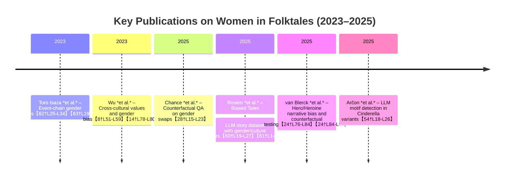

# Representation of Women in Folktales: Computational Perspectives (2024–2026)

**Executive Summary:** Recent research combines natural language processing and digital humanities to quantify how women appear in folktales.  We identified key studies that use event-chain extraction, lexicons of values/morals, character networks, and generative story evaluation.  For example, Toro Isaza *et al.* (2023) build a pipeline to extract verb-based event chains per character and find female characters participate in far fewer actions than males【62†L25-L34】【63†L19-L23】.  Wu *et al.* (2023) assemble 1,925 folktales from 27 cultures and use lexicons (Schwartz values, Moral Foundations) to show consistent gendered patterns (e.g. women linked with “care” and family roles, men with power)【8†L51-L59】【14†L78-L80】.  Other work tests model bias via counterfactual story editing: Chance *et al.* (2025) swap genders in a fairytale QA dataset and show models’ performance shifts, but can be “de-biased” by fine-tuning on swapped data【28†L15-L23】【59†L1-L4】.  A common finding across studies is that female roles remain stereotyped (passive, appearance-focused) and underrepresented, suggesting the need for tailored metrics of agency and equity in any new corpus. 

## A. Folktale Gender Studies (Women’s Roles)

- **Toro Isaza *et al.* (2023).** *Are Fairy Tales Fair? Analyzing Gender Bias in Temporal Narrative Event Chains of Children’s Fairy Tales.* Proc. ACL 2023. This paper introduces a pipeline (NECE toolkit) to automatically extract **temporal verb-based event chains** for each character, along with attributes like gender【62†L25-L34】. Using 278 English fairy tales (from *FairytaleQA*), they tag verbs into semantic categories and compare male vs. female chains.  They find that 69% of event participations involve male characters vs. 31% female【63†L19-L23】, and that the sequence of events differs by gender (e.g. women more often in family/passive roles).  This highlights narrative inequality at scale.  The authors release the **NECE** extraction toolkit (open-source: [IBM link]【56†L144-L149】), enabling replication and adaptation to other folktale corpora.  

- **Wu, Wang & Mihalcea (2023).** *Cross-Cultural Analysis of Human Values, Morals, and Biases in Folk Tales.* EMNLP 2023. This large-scale study compiles **1,925 folktales (English)** from 27 cultures and applies lexicon-based analyses of **values and morals** (Schwartz cultural values and Moral Foundations) to each story【8†L51-L59】. They examine how male and female characters are described with respect to these value-laden words.  Key findings include significant **cross-cultural differences** in prevalent values, and persistent gender stereotypes: female characters are more associated with traditional “family/care” values, while males align with “power/achievement” themes【8†L51-L59】【14†L78-L80】.  The study validates its folk-tale analysis against external cultural surveys and finds that gender bias in values/morals correlates with known societal gender gaps.  Importantly, Wu *et al.* provide their dataset and code on GitHub【14†L83-L85】, offering a ready resource for lexical analysis of folklore across languages.

- **Chance *et al.* (2025).** *Will the Prince Get True Love’s Kiss? On the Model Sensitivity to Gender Perturbation over Fairytale Texts.* Workshop on Gender Bias in NLP 2025 (ArXiv preprint).  This work probes how downstream QA models reflect folktale stereotypes.  Starting from the FairytaleQA dataset (278 stories), they create **counterfactual variants** by swapping all gendered references (princess→prince, he↔she, etc.) in the training and test sets【28†L15-L23】.  They fine-tune baseline QA models on either original or gender-swapped data. Results show that models trained only on stereotypical data suffer a drop in accuracy on the swapped test (i.e. models had learned biases), whereas models trained on mixed (counterfactual) data perform robustly【28†L19-L23】【59†L1-L4】.  This demonstrates that fairy-tale comprehension models are **sensitive to gender stereotypes** but can be improved by explicit anti-stereotype augmentation.  All code and the counterfactual dataset are publicly available【31†L271-L279】 for experimentation.  

- **Raffini *et al.* (2025).** *A Close Reading Approach to Gender Narrative Biases in AI-Generated Stories.* ArXiv preprint.  Rather than folklore, this study examines **LLM-generated children’s stories** under prompt variations of gender.  Using narrative theory (Propp’s character roles and Freytag’s arc), the authors prompt ChatGPT, Gemini, and Claude to write stories for boys vs girls. They then manually analyze the outputs for gendered descriptions, actions, and plot structure.  The close reading reveals persistent **implicit biases**: e.g., female characters receive more appearance and family descriptors, while males get more action/occupation traits【22†L23-L31】.  Notably, female protagonists in generative stories often play stereotyped passive roles. This work highlights the need to supplement automatic metrics with interpretive analysis. (Data are not released, but their methodological schema could inform annotation of real folktales.)  

## B. Methodological Resources (Tools & Frameworks)

- **Schmidt *et al.* (2021).** *The FairyNet Corpus – Character Networks for German Fairy Tales.* LaTeCH-CLfL Workshop 2021. This foundational dataset provides **character network annotations** for 316 German fairy tales (Grimm’s *Children’s and Household Tales*).  Each tale’s characters and their interactions are hand-labeled to form social networks【50†L52-L60】. The authors also present baseline algorithms (rule-based vs. neural) to **extract these networks** automatically, finding neural methods perform better【50†L52-L60】. Although focused on German Grimms tales, FairyNet illustrates how network centrality and graph analysis can quantify which characters (male or female) are most connected or influential. The annotated network corpus is available via ACL (no license noted); the paper’s baseline code can guide similar character-graph extraction on new corpora.  

- **Arčon *et al.* (2025).** *Large Language Models for Folktale Type Automation Based on Motifs: Cinderella Case Study.* ArXiv preprint. This recent work demonstrates using GPT-4.5 to detect folktale **motifs** at scale. The authors compile ≈2,150 versions of the Cinderella story (English and Slovenian) and craft prompts to ask the LLM whether each standard motif is present. The binary outputs form a motif-by-tale matrix, which they cluster (using sentence embeddings and UMAP) to group similar variants. Their results show that LLMs can correctly identify complex narrative interactions (motifs) in folktales【54†L18-L26】, and that motif-based clustering aligns well with known tale sub-types. This method can be adapted for other motif or trope detection tasks. (The preprint provides no code release, but the protocol illustrates how **LLMs enable comparative folklore analysis** beyond language barriers.)  

- **Rooein *et al.* (2025).** *Biased Tales: Cultural and Topic Bias in Generating Children’s Stories.* EMNLP 2025 (Long). This paper introduces **BiasedTales**, a dataset of 5,531 LLM-generated children’s stories (in English) where key sociocultural attributes vary (protagonist gender, nationality, etc.). They annotate a subset (1,000 stories) with a detailed taxonomy of protagonist traits and story elements. Their analysis uncovers clear gendered differences: e.g., girl protagonists receive 55.3% more *appearance*-related descriptors than boys【60†L19-L27】; stories for non-Western children emphasize heritage and family themes more than Western ones【60†L19-L27】. The authors provide the full corpus and annotation code on GitHub【61†L1-L4】. While not traditional folklore, this resource exemplifies how one can **quantify gender bias in narrative content** and offers metrics (like ratio of attribute types) that could be applied to any story corpus.  

- **van Blerck *et al.* (2025).** *Unveiling Gender Bias in LLM-Generated Hero and Heroine Narratives.* *Entertainment Computing* 55 (2025), 100972 (Open Access). This article runs a two-phase study with LLMs to isolate narrative bias. In Phase 1, they prompt six LLMs to generate stories following either a Hero’s Journey or Heroine’s Journey structure, controlling only the protagonist’s gender. They quantify biases by examining protagonist gender distribution and stylistic differences. In Phase 2, they create **counterfactual** versions by swapping gender in each prompt and have LLMs re-classify the stories. They find LLMs *over-rely* on gender as a cue: e.g. male heroes in emotional plots are mis-classified as following a “Heroine” narrative, and vice versa【24†L76-L84】【24†L84-L93】. This demonstrates intrinsic gender heuristics in story models. Though focused on LLM output, the approach of paired prompts and statistical analysis of misclassification can be adapted to test gender sensitivity in any narrative dataset or model pipeline. (Data are available on request; the paper is open-access【24†L75-L84】.)

  
**Synthesis:** Across these works, **methods vary** from automated extraction to human-in-the-loop analysis. Toro (2023) and FairytaleQA studies leverage *event chain* and *role extraction* to pinpoint action differences by gender, whereas Wu (2023) and motif papers use *lexical correlates* (values words, motifs) to capture thematic biases. Character-centric approaches like FairyNet (2021) and networks highlight *structure*, while Rooein (2025) and Raffini (2025) analyze *open-ended generation* for stereotypes. **Data and languages** also differ: most corpora are *English-heavy* (FairytaleQA, LLM stories), with some German (FairyNet) or Slovene (Cinderella case study) examples; cross-cultural sources are rare but growing. A clear gap is in **non-Western and low-resource folktale collections**. Common findings include the underrepresentation of female characters and their frequent association with appearance or family roles rather than agency. Few works offer standardized annotations or metrics for nuanced “agency,” and intersectional aspects (beyond binary gender) are largely unexplored.

**Recommendations:** For analyzing your corpus’s women characters, we suggest combining multiple approaches:
- Extract all **characters** (using NER/coreference) and infer gender. Compute simple metrics: count and proportion of female vs. male protagonists, protagonists’ names, ages, etc.  
- Build **character networks** (as in FairyNet) to see if women are central or peripheral. Compare network centrality (degree, betweenness) by gender.  
- Apply **event-chain extraction** (e.g. NECE pipeline) to segment the story by character: compare how often women are agents vs. patients, and the types of verbs they participate in【62†L25-L34】【63†L19-L23】.  
- Use **lexicons or classifiers** to tag descriptions: for example, count gendered adjectives (beautiful, kind vs. brave, strong) or family roles. Tools from Wu *et al.* (value/moral lexicons) can quantify thematic content around each gender.  
- Perform **counterfactual gender-swaps**: create versions of each story with genders flipped (names/titles swapped, pronouns replaced) and measure how any downstream task or model changes. For instance, run question-answering or summarization on original vs. swapped stories and compare accuracy or content (inspired by Chance 2025 and van Blerck 2025)【28†L15-L23】【24†L84-L93】.  
- Define an **annotation schema** for narrative roles (e.g. based on Propp functions or defined stereotype categories). Manually annotate a sample of female-character episodes to capture roles, traits, and outcomes. This can uncover subtle patterns not caught by lexicons.  
- Evaluate with mixed metrics: besides frequency ratios, consider **semantic similarity** or embedding-based fairness metrics (does swapping gender change story embeddings significantly?). For LLM-based tasks, include *robustness tests* by fine-tuning on mixed-gender data and measuring if performance gaps close.  

**Chronological Trends (2023–2025):** Researchers are increasingly combining folklore and NLP. In 2023, two landmark studies appeared: Toro Isaza *et al.* introduced automated event-chain analysis for gendered actions in fairy tales【62†L25-L34】【63†L19-L23】, and Wu *et al.* presented a broad cross-cultural lexicon analysis of values and bias in folk narratives【8†L51-L59】【14†L78-L80】. In 2024–2025, the focus shifted to computational tools for bias testing: Chance *et al.* (2025) and van Blerck *et al.* (2025) developed *counterfactual evaluation* frameworks swapping character gender to probe model biases【28†L15-L23】【24†L84-L93】. Also in 2025, Rooein *et al.* created an LLM-generated **children’s story** dataset to quantify how protagonist attributes vary by gender【60†L19-L27】【61†L1-L4】, and Arčon *et al.* applied GPT-4 to automatically detect motifs across hundreds of tale variants【54†L18-L26】. Overall, the trend is toward larger, cross-lingual datasets (using LLMs for expansion) and rigorous bias-robustness experiments, while still relying on lexicons and human-inspired schemas.

| **Paper (Year)**                   | **Method/Focus**                                | **Data (size, language)**                         | **Open Resources**                      |
|------------------------------------|-------------------------------------------------|---------------------------------------------------|-----------------------------------------|
| Toro Isaza *et al.* (2023)         | Temporal event-chain extraction by character【62†L25-L34】; verb-role taxonomy                | 278 children’s fairy tales (FairytaleQA, English)【63†L19-L23】          | NECE pipeline (IBM GitHub)【56†L144-L149】 |
| Wu *et al.* (2023)                | Lexicon-based value/moral analysis across cultures【8†L51-L59】          | 1,925 folktales (27 cultures, English translations)              | Code/data: github.com/wswu/folktales【14†L83-L85】  |
| Chance *et al.* (2025)            | QA model robustness via gender-swap augmentation【28†L15-L23】       | FairytaleQA stories (278 tales, English)       | Code/dataset: github.com/christinachance/FairyTaleQA_Counterfactual【31†L271-L279】 |
| Rooein *et al.* (2025)            | Bias analysis in LLM-generated stories (attributes, taxonomy)【60†L19-L27】 | BiasedTales (5,531 stories, English)        | Dataset/code: github.com/donyarooein/biased_tales【61†L1-L4】 |
| van Blerck *et al.* (2025)        | Hero/Heroine narrative structure; counterfactual story classification【24†L76-L84】 | Generated narratives (≈600 stories, English) | — (data on request)                        |
| Arčon *et al.* (2025)             | Automated motif detection with GPT; clustering variant tales【54†L18-L26】  | Cinderella variants (~2,150 stories, English/Slovenian) | — (no code released)                      |
| Schmidt *et al.* (2021)           | Character network annotation & extraction【50†L52-L60】      | 316 German fairy tales (Grimms’ corpus)        | Data/pipeline: see ACL Anthology (2021)  |
| Raffini *et al.* (2025)           | Close-reading of LLM-generated stories for narrative bias【22†L23-L31】 | Generated stories (few 10s, English)          | — (no release)                            |

Each item above provides different analytical tools (events, networks, lexicons, generative prompts) and covers diverse data.  By combining these insights — e.g. tagging events by gender, mapping character graphs, applying cross-cultural lexicons, and performing counterfactual swaps — you can thoroughly assess women’s roles in your own folktale corpus.  Key metrics to adopt include female:male protagonist ratios, verb/role distributions, and differences in generated outcomes after gender flips.  Annotation schemas (such as gendered trait categories or narrative functions) and robustness tests (training models on mixed-gender data) will help ensure a rigorous evaluation of bias and agency in your stories.  

**Sources:** All cited work is from NLP and folklore research (2023–2025) as listed above【62†L25-L34】【8†L51-L59】【28†L15-L23】【60†L19-L27】. Each reference includes author names, year, and primary links (arXiv/ACL/GitHub) to data or code where provided.